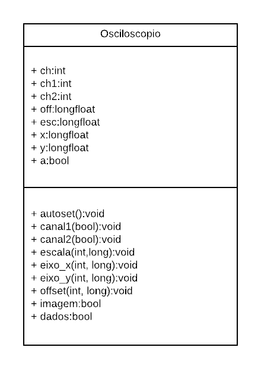
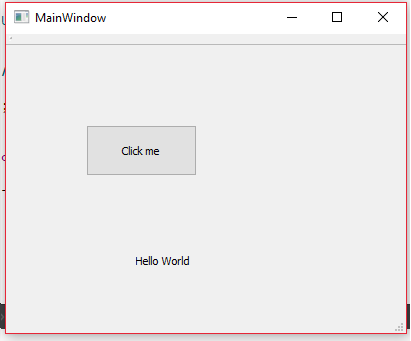
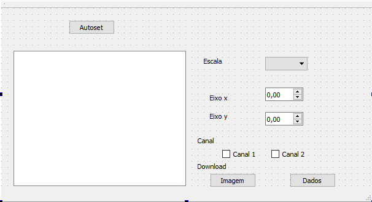
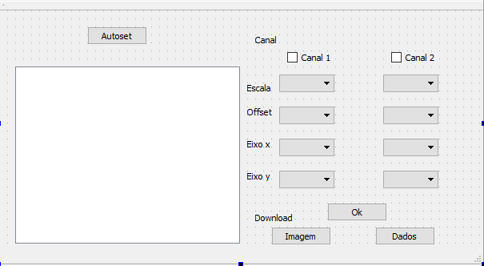

#VF
# victor_configurar_osciloscopio_PC

Objetivo: Desenvolver um software para configurar o osciloscópio via PC, com obtenção de curvas de medidas.

Motivação do projeto: Criar um ambiente melhor e menos complexo no PC para a obtenção de imagens e curvas de medidas do osciloscópio e na configuração do osciloscópio.

Função: Pela porta COM do PC receber as informações e enviar os comandos, utilizando a sintaxe da linguagem do próprio oscilocópio, para configurar e pegar os dados da curva de medida.

#Fluxograma:

#Diagrama de Classe:

#TRABALHO DA VE
# victor_configurar_osciloscopio_PC

Objetivo: Desenvolver um software para configurar o osciloscópio via PC, com obtenção de curvas de medidas.

Motivação do projeto: Criar um ambiente melhor e menos complexo no PC para a obtenção de imagens e curvas de medidas do osciloscópio e na configuração do osciloscópio.

Função: Pela porta COM do PC receber as informações e enviar os comandos, utilizando a sintaxe da linguagem do próprio oscilocópio, para configurar e pegar os dados da curva de medida.

# Tutorial: 
Fiz o tutorial do seguinte link: https://www.youtube.com/watch?v=3SIj6zL6mmA
Teve como resultado:

/*# Esboço:

  Temos que a tela em branco irá mostrar a tela do osciloscópio, o botão Autoset irá desempenhar o mesmo papel do botão Autoset no osciloscópio, a escala determinará a escala do gráfico da função de onda, as caixas Eixo x e y são para transladar a origem no gráfico, a opção canal é para determinar qual canal vai ficar a mostra na tela e os botões Dados e Imagem serve para fazer o download ou os dados da curva de medida ou a imagem da tela do osciloscópio.*/

# "Funcionamento" do programa:

Aqui tenho a GUi que suponho que será a final.

  Temos que a tela em branco irá mostrar a tela do osciloscópio, o botão Autoset irá desempenhar o mesmo papel do botão Autoset no osciloscópio, a escala(eixo x) determinará a escala do gráfico da função de onda e o offset irá determinar a escala(eixo y), as caixas Eixo x(entre 1 e 249) e y(entre 1 e 199) são para transladar a origem no gráfico, a opção canal é para determinar qual canal vai ficar a mostra na tela e os botões Dados e Imagem serve para fazer o download ou os dados da curva de medida ou a imagem da tela do osciloscópio. O botão Ok irá setar a nova configuração.
  
  Problemas: 
 
 1° Conexão com a porta COM para mandar comandos pro osciloscópio, não consegui ter acesso a Biblioteca do osciloscópio, por isso, não consegui enviar os comandos, mesmo tendo a sitaxe da biblioteca.
  
  2° Conseguir transformar o input das QComboBox do Qt de string para int/float, para conseguir setar a nova configuração.

3° Não encontrei a função para pegar os dados do osciloscópio e nem para copiar a tela para a GUI.
